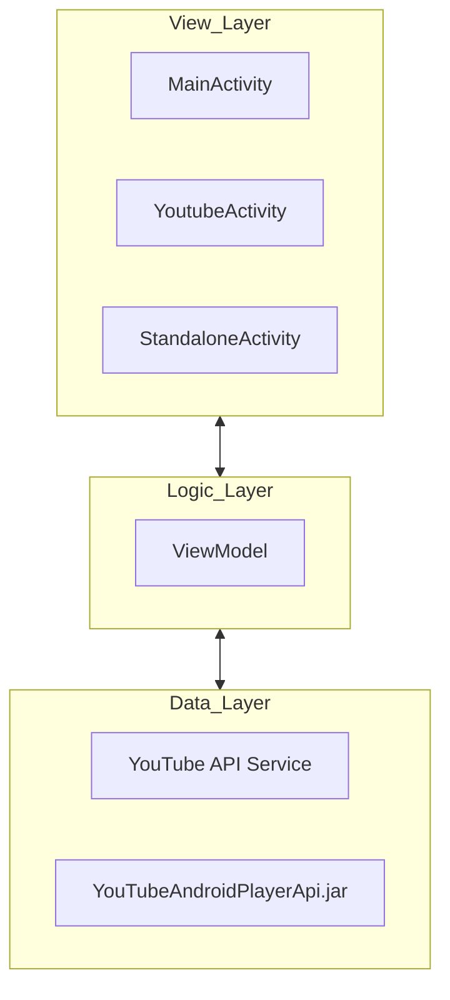
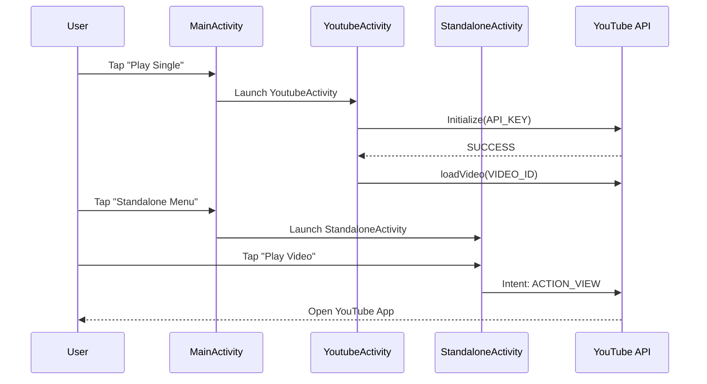

# 📺 YouTube Player - Android Masterclass 🚀

<p align="center">
  
</p>

<p align="center">
  
  
  
  
</p>

---

## 🌟 Overview

**YouTube Player** is a high-performance, modern Android application developed as part of an **Android App Development Masterclass**. This project serves as a comprehensive deep dive into the **Kotlin** programming language and the **Android Ecosystem**. 

It demonstrates the seamless integration of the **YouTube Android Player API**, allowing users to stream videos and playlists directly within a custom-built environment. This project isn't just an app; it's a testament to mastering professional Android development workflows.

---

## 📸 Screen-by-Screen Walkthrough

### 🏠 Dashboard & Navigation
The journey begins at the Dashboard, where users can choose between an embedded player experience or a standalone intent-based approach.

<p align="center">
  
  
  
  
</p>

### 🎬 Video Playback Experience
Integrated playback allows for a seamless experience without leaving the application.

<p align="center">
  
  
</p>

---

## ✨ Key Features

- 🎥 **Integrated Video Playback:** Seamlessly play YouTube videos within the app using `YouTubePlayerView`.
- 📂 **Playlist Support:** Full support for loading and navigating through YouTube playlists.
- 🛠️ **Standalone Player:** Launch the official YouTube player via Intent for a native experience.
- 🎮 **Playback Controls:** Granular control over play, pause, seek, and buffering states.
- 📱 **Responsive Design:** Optimized layouts for a fluid user experience across various screen sizes.
- 🔔 **Event Handling:** Real-time feedback using `PlaybackEventListener` and `PlayerStateChangeListener`.

---

## 🏗️ Architecture & Flow

### 🛠 MVVM Pattern
The project is built following the **Model-View-ViewModel (MVVM)** architectural pattern to ensure separation of concerns, testability, and maintainability.



### 🔄 User Flow


---

## 📊 MAD Score (Modern Android Development)

| Category | Status | Tech Used |
| :--- | :---: | :--- |
| **Language** | ✅ | Kotlin 1.7+ |
| **UI** | ✅ | View System / XML |
| **Architecture** | ✅ | MVVM Architecture |
| **Libraries** | ✅ | Jetpack (AppCompat, KTX) |
| **Tooling** | ✅ | Android Studio Dolphin+ |

---

## 📂 Project Structure

```text
app/src/main/java/com/gamebit/youtubeplayer/
├── MainActivity.kt        # Dashboard entry point
├── YoutubeActivity.kt     # Embedded player implementation
└── StandaloneActivity.kt  # Intent-based player controls

app/src/main/res/layout/
├── activity_main.xml      # Dashboard interface
├── activity_youtube.xml   # Player interface
└── activity_standalone.xml # Standalone control interface
```

---

## 🛠 Tech Stack

- **Language:** [Kotlin](https://kotlinlang.org/) - Modern, expressive, and safe.
- **Layout:** [ConstraintLayout](https://developer.android.com/training/constraint-layout) - For complex, flat hierarchies.
- **API:** [YouTube Android Player API](https://developers.google.com/youtube/android/player) - Official Google API.
- **Components:** [Material Design](https://material.io/) - For a modern look and feel.
- **Extension:** [Kotlin Android Extensions](https://kotlinlang.org/docs/parcelable.html) - Synthetic view binding.

---

## 🚀 Getting Started

1. **Clone the repository:**
   ```bash
   git clone https://github.com/yourusername/YouTubePlayer.git
   ```
2. **Obtain a YouTube API Key:**
   - Go to [Google Developers Console](https://console.developers.google.com/).
   - Create a project and enable the "YouTube Data API v3".
   - Generate an API Key.
3. **Add the Key to the project:**
   - Create/Update `app/src/main/res/values/keys.xml`:
     ```xml
     <resources>
         <string name="GOOGLE_API_KEY">YOUR_API_KEY_HERE</string>
     </resources>
     ```
4. **Run the app:**
   - Open in Android Studio and hit **Run**!

---

## 🤝 Acknowledgements

- **Udemy Masterclass:** Inspiration and guidance for this educational project.
- **Google Developers:** For providing the YouTube Player API documentation.

---

<p align="center">
  Made with ❤️ for learning Android Development
</p>
